```python
import pandas as pd
import numpy as np
import matplotlib.pyplot as plt
import scipy.stats as sts
%matplotlib inline
import statistics
import seaborn as sns
from sklearn import preprocessing
from pylab import rcParams
rcParams['figure.figsize'] = 10,7
from sklearn.model_selection import train_test_split
from sklearn.ensemble import RandomForestClassifier

```


```python
hr = pd.read_csv('HR1.csv') 
hr.columns=['satisfaction_level', 'last_evaluation', 'number_projec', 'average_montly_hours',
            'time_spend_company', 'Work_accident', 'left', 'promotion_last_5years','department', 'salary']
hr.head()
```


<div>
<style scoped>
    .dataframe tbody tr th:only-of-type {
        vertical-align: middle;
    }

    .dataframe tbody tr th {
        vertical-align: top;
    }

    .dataframe thead th {
        text-align: right;
    }
</style>
<table border="1" class="dataframe">
  <thead>
    <tr style="text-align: right;">
      <th></th>
      <th>satisfaction_level</th>
      <th>last_evaluation</th>
      <th>number_projec</th>
      <th>average_montly_hours</th>
      <th>time_spend_company</th>
      <th>Work_accident</th>
      <th>left</th>
      <th>promotion_last_5years</th>
      <th>department</th>
      <th>salary</th>
    </tr>
  </thead>
  <tbody>
    <tr>
      <th>0</th>
      <td>0.38</td>
      <td>0.53</td>
      <td>2</td>
      <td>157</td>
      <td>3</td>
      <td>0</td>
      <td>1</td>
      <td>0</td>
      <td>sales</td>
      <td>low</td>
    </tr>
    <tr>
      <th>1</th>
      <td>0.80</td>
      <td>0.86</td>
      <td>5</td>
      <td>262</td>
      <td>6</td>
      <td>0</td>
      <td>1</td>
      <td>0</td>
      <td>sales</td>
      <td>medium</td>
    </tr>
    <tr>
      <th>2</th>
      <td>0.11</td>
      <td>0.88</td>
      <td>7</td>
      <td>272</td>
      <td>4</td>
      <td>0</td>
      <td>1</td>
      <td>0</td>
      <td>sales</td>
      <td>medium</td>
    </tr>
    <tr>
      <th>3</th>
      <td>0.72</td>
      <td>0.87</td>
      <td>5</td>
      <td>223</td>
      <td>5</td>
      <td>0</td>
      <td>1</td>
      <td>0</td>
      <td>sales</td>
      <td>low</td>
    </tr>
    <tr>
      <th>4</th>
      <td>0.37</td>
      <td>0.52</td>
      <td>2</td>
      <td>159</td>
      <td>3</td>
      <td>0</td>
      <td>1</td>
      <td>0</td>
      <td>sales</td>
      <td>low</td>
    </tr>
  </tbody>
</table>
</div>


### Рассчитать основные статистики для переменных (среднее,медиана,мода,мин/макс,сред.отклонение).


```python
hr.describe()
```


<div>
<style scoped>
    .dataframe tbody tr th:only-of-type {
        vertical-align: middle;
    }

    .dataframe tbody tr th {
        vertical-align: top;
    }

    .dataframe thead th {
        text-align: right;
    }
</style>
<table border="1" class="dataframe">
  <thead>
    <tr style="text-align: right;">
      <th></th>
      <th>satisfaction_level</th>
      <th>last_evaluation</th>
      <th>number_projec</th>
      <th>average_montly_hours</th>
      <th>time_spend_company</th>
      <th>Work_accident</th>
      <th>left</th>
      <th>promotion_last_5years</th>
    </tr>
  </thead>
  <tbody>
    <tr>
      <th>count</th>
      <td>14999.000000</td>
      <td>14999.000000</td>
      <td>14999.000000</td>
      <td>14999.000000</td>
      <td>14999.000000</td>
      <td>14999.000000</td>
      <td>14999.000000</td>
      <td>14999.000000</td>
    </tr>
    <tr>
      <th>mean</th>
      <td>0.612834</td>
      <td>0.716102</td>
      <td>3.803054</td>
      <td>201.050337</td>
      <td>3.498233</td>
      <td>0.144610</td>
      <td>0.238083</td>
      <td>0.021268</td>
    </tr>
    <tr>
      <th>std</th>
      <td>0.248631</td>
      <td>0.171169</td>
      <td>1.232592</td>
      <td>49.943099</td>
      <td>1.460136</td>
      <td>0.351719</td>
      <td>0.425924</td>
      <td>0.144281</td>
    </tr>
    <tr>
      <th>min</th>
      <td>0.090000</td>
      <td>0.360000</td>
      <td>2.000000</td>
      <td>96.000000</td>
      <td>2.000000</td>
      <td>0.000000</td>
      <td>0.000000</td>
      <td>0.000000</td>
    </tr>
    <tr>
      <th>25%</th>
      <td>0.440000</td>
      <td>0.560000</td>
      <td>3.000000</td>
      <td>156.000000</td>
      <td>3.000000</td>
      <td>0.000000</td>
      <td>0.000000</td>
      <td>0.000000</td>
    </tr>
    <tr>
      <th>50%</th>
      <td>0.640000</td>
      <td>0.720000</td>
      <td>4.000000</td>
      <td>200.000000</td>
      <td>3.000000</td>
      <td>0.000000</td>
      <td>0.000000</td>
      <td>0.000000</td>
    </tr>
    <tr>
      <th>75%</th>
      <td>0.820000</td>
      <td>0.870000</td>
      <td>5.000000</td>
      <td>245.000000</td>
      <td>4.000000</td>
      <td>0.000000</td>
      <td>0.000000</td>
      <td>0.000000</td>
    </tr>
    <tr>
      <th>max</th>
      <td>1.000000</td>
      <td>1.000000</td>
      <td>7.000000</td>
      <td>310.000000</td>
      <td>10.000000</td>
      <td>1.000000</td>
      <td>1.000000</td>
      <td>1.000000</td>
    </tr>
  </tbody>
</table>
</div>


Посколько метод describe не включает в себя расчет моды, ее мы рассчитаем отдельно


```python
hr.mode()
```


<div>
<style scoped>
    .dataframe tbody tr th:only-of-type {
        vertical-align: middle;
    }

    .dataframe tbody tr th {
        vertical-align: top;
    }

    .dataframe thead th {
        text-align: right;
    }
</style>
<table border="1" class="dataframe">
  <thead>
    <tr style="text-align: right;">
      <th></th>
      <th>satisfaction_level</th>
      <th>last_evaluation</th>
      <th>number_projec</th>
      <th>average_montly_hours</th>
      <th>time_spend_company</th>
      <th>Work_accident</th>
      <th>left</th>
      <th>promotion_last_5years</th>
      <th>department</th>
      <th>salary</th>
    </tr>
  </thead>
  <tbody>
    <tr>
      <th>0</th>
      <td>0.1</td>
      <td>0.55</td>
      <td>4.0</td>
      <td>135</td>
      <td>3.0</td>
      <td>0.0</td>
      <td>0.0</td>
      <td>0.0</td>
      <td>sales</td>
      <td>low</td>
    </tr>
    <tr>
      <th>1</th>
      <td>NaN</td>
      <td>NaN</td>
      <td>NaN</td>
      <td>156</td>
      <td>NaN</td>
      <td>NaN</td>
      <td>NaN</td>
      <td>NaN</td>
      <td>NaN</td>
      <td>NaN</td>
    </tr>
  </tbody>
</table>
</div>


Из таблицы видно, что у параметра 'average_montly_hours' есть 2 значения, которые встречаются с одинаковой частотой, что не позволяет выделить одну единственную моду

### Рассчитать и визуализировать корреляционную матрицу для переменных

Чтобы посмотреть корреляцию между уровнем зарплаты и всеми остальными перемеными, переведем значения 'low','medium' и 'high' в численные показатели.


```python
def salary_level(a):
    if a =='low':
        return 1
    elif a =='medium':
        return 2
    elif a == 'high':
        return 3
hr['salary_level'] = hr['salary'].apply(salary_level)
hr.head()
```


<div>
<style scoped>
    .dataframe tbody tr th:only-of-type {
        vertical-align: middle;
    }

    .dataframe tbody tr th {
        vertical-align: top;
    }

    .dataframe thead th {
        text-align: right;
    }
</style>
<table border="1" class="dataframe">
  <thead>
    <tr style="text-align: right;">
      <th></th>
      <th>satisfaction_level</th>
      <th>last_evaluation</th>
      <th>number_projec</th>
      <th>average_montly_hours</th>
      <th>time_spend_company</th>
      <th>Work_accident</th>
      <th>left</th>
      <th>promotion_last_5years</th>
      <th>department</th>
      <th>salary</th>
      <th>salary_level</th>
    </tr>
  </thead>
  <tbody>
    <tr>
      <th>0</th>
      <td>0.38</td>
      <td>0.53</td>
      <td>2</td>
      <td>157</td>
      <td>3</td>
      <td>0</td>
      <td>1</td>
      <td>0</td>
      <td>sales</td>
      <td>low</td>
      <td>1</td>
    </tr>
    <tr>
      <th>1</th>
      <td>0.80</td>
      <td>0.86</td>
      <td>5</td>
      <td>262</td>
      <td>6</td>
      <td>0</td>
      <td>1</td>
      <td>0</td>
      <td>sales</td>
      <td>medium</td>
      <td>2</td>
    </tr>
    <tr>
      <th>2</th>
      <td>0.11</td>
      <td>0.88</td>
      <td>7</td>
      <td>272</td>
      <td>4</td>
      <td>0</td>
      <td>1</td>
      <td>0</td>
      <td>sales</td>
      <td>medium</td>
      <td>2</td>
    </tr>
    <tr>
      <th>3</th>
      <td>0.72</td>
      <td>0.87</td>
      <td>5</td>
      <td>223</td>
      <td>5</td>
      <td>0</td>
      <td>1</td>
      <td>0</td>
      <td>sales</td>
      <td>low</td>
      <td>1</td>
    </tr>
    <tr>
      <th>4</th>
      <td>0.37</td>
      <td>0.52</td>
      <td>2</td>
      <td>159</td>
      <td>3</td>
      <td>0</td>
      <td>1</td>
      <td>0</td>
      <td>sales</td>
      <td>low</td>
      <td>1</td>
    </tr>
  </tbody>
</table>
</div>


Рассчитываем корреляционную матрицу:


```python
hr.corr()
```


<div>
<style scoped>
    .dataframe tbody tr th:only-of-type {
        vertical-align: middle;
    }

    .dataframe tbody tr th {
        vertical-align: top;
    }

    .dataframe thead th {
        text-align: right;
    }
</style>
<table border="1" class="dataframe">
  <thead>
    <tr style="text-align: right;">
      <th></th>
      <th>satisfaction_level</th>
      <th>last_evaluation</th>
      <th>number_projec</th>
      <th>average_montly_hours</th>
      <th>time_spend_company</th>
      <th>Work_accident</th>
      <th>left</th>
      <th>promotion_last_5years</th>
      <th>salary_level</th>
    </tr>
  </thead>
  <tbody>
    <tr>
      <th>satisfaction_level</th>
      <td>1.000000</td>
      <td>0.105021</td>
      <td>-0.142970</td>
      <td>-0.020048</td>
      <td>-0.100866</td>
      <td>0.058697</td>
      <td>-0.388375</td>
      <td>0.025605</td>
      <td>0.050022</td>
    </tr>
    <tr>
      <th>last_evaluation</th>
      <td>0.105021</td>
      <td>1.000000</td>
      <td>0.349333</td>
      <td>0.339742</td>
      <td>0.131591</td>
      <td>-0.007104</td>
      <td>0.006567</td>
      <td>-0.008684</td>
      <td>-0.013002</td>
    </tr>
    <tr>
      <th>number_projec</th>
      <td>-0.142970</td>
      <td>0.349333</td>
      <td>1.000000</td>
      <td>0.417211</td>
      <td>0.196786</td>
      <td>-0.004741</td>
      <td>0.023787</td>
      <td>-0.006064</td>
      <td>-0.001803</td>
    </tr>
    <tr>
      <th>average_montly_hours</th>
      <td>-0.020048</td>
      <td>0.339742</td>
      <td>0.417211</td>
      <td>1.000000</td>
      <td>0.127755</td>
      <td>-0.010143</td>
      <td>0.071287</td>
      <td>-0.003544</td>
      <td>-0.002242</td>
    </tr>
    <tr>
      <th>time_spend_company</th>
      <td>-0.100866</td>
      <td>0.131591</td>
      <td>0.196786</td>
      <td>0.127755</td>
      <td>1.000000</td>
      <td>0.002120</td>
      <td>0.144822</td>
      <td>0.067433</td>
      <td>0.048715</td>
    </tr>
    <tr>
      <th>Work_accident</th>
      <td>0.058697</td>
      <td>-0.007104</td>
      <td>-0.004741</td>
      <td>-0.010143</td>
      <td>0.002120</td>
      <td>1.000000</td>
      <td>-0.154622</td>
      <td>0.039245</td>
      <td>0.009247</td>
    </tr>
    <tr>
      <th>left</th>
      <td>-0.388375</td>
      <td>0.006567</td>
      <td>0.023787</td>
      <td>0.071287</td>
      <td>0.144822</td>
      <td>-0.154622</td>
      <td>1.000000</td>
      <td>-0.061788</td>
      <td>-0.157898</td>
    </tr>
    <tr>
      <th>promotion_last_5years</th>
      <td>0.025605</td>
      <td>-0.008684</td>
      <td>-0.006064</td>
      <td>-0.003544</td>
      <td>0.067433</td>
      <td>0.039245</td>
      <td>-0.061788</td>
      <td>1.000000</td>
      <td>0.098119</td>
    </tr>
    <tr>
      <th>salary_level</th>
      <td>0.050022</td>
      <td>-0.013002</td>
      <td>-0.001803</td>
      <td>-0.002242</td>
      <td>0.048715</td>
      <td>0.009247</td>
      <td>-0.157898</td>
      <td>0.098119</td>
      <td>1.000000</td>
    </tr>
  </tbody>
</table>
</div>


```python
sns.heatmap(hr.corr(),annot=True,cmap='coolwarm',linewidths=0.8) 
fig=plt.gcf()
fig.set_size_inches(10,10)
plt.show()
```


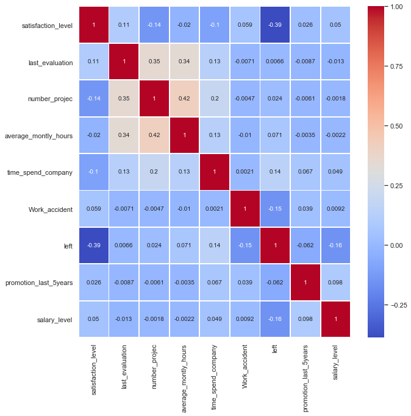


Из матрицы корреляций видно, что между всеми показателями достаточно низкая сила связи. Самая сильная зависимость наблюдается между показателями 'satisfaction_level' и 'left'.

### Визуализировать несколько взаимосвязей между переменными.


```python
sns_plot = sns.pairplot(
    hr[['satisfaction_level', 'last_evaluation', 'number_projec', 'average_montly_hours',
        'time_spend_company', 'left','department', 'salary_level']])
```


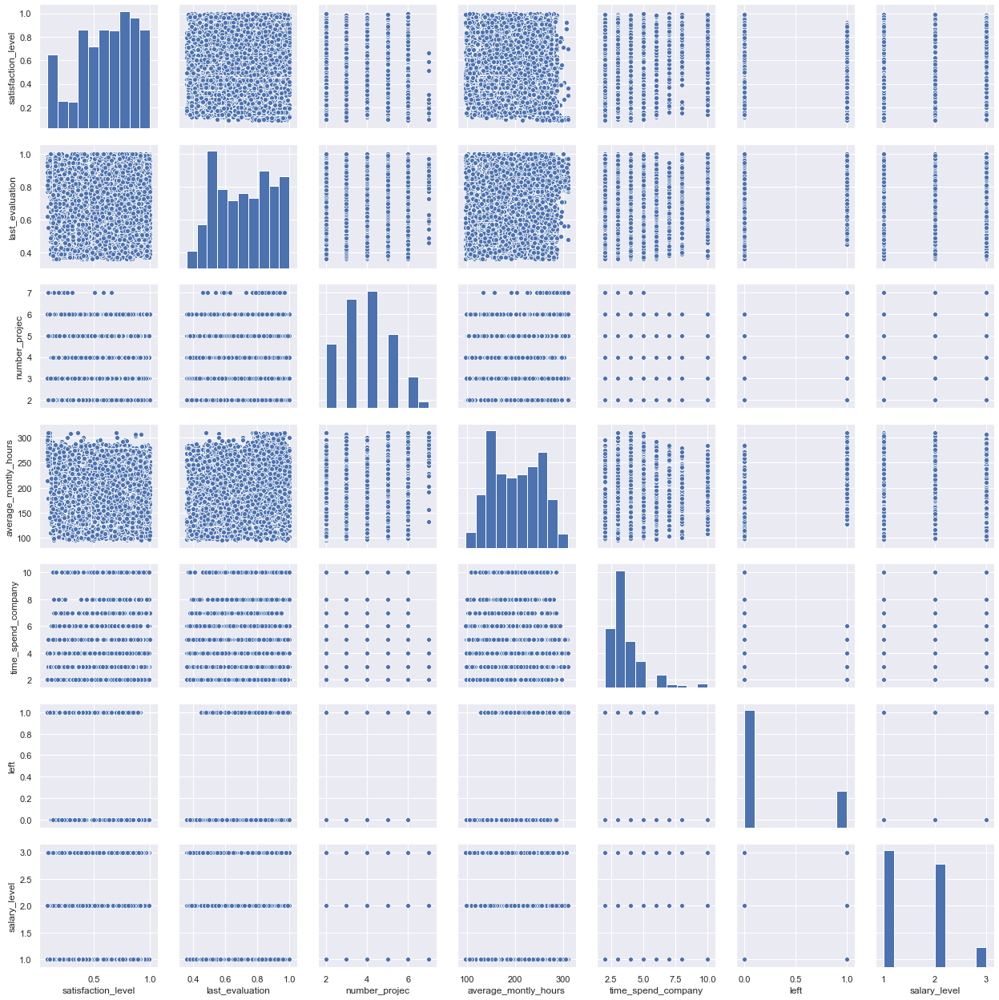


На графиках мы тоже можем наблюдать отсутствие линейных связей.

### С использованием t-test статистики проверить взаимосвязи между несколькими переменными.


Посмотрим, есть ли разница в уровне удовлетворенности между теми, кто получил высокие и низкие оценки. Низкой оценкой будем считать баллы до 0,5, а все что выше 0,5 - высокой оценкой.


```python
low_evaluation= hr[hr['last_evaluation']<=0.5]['satisfaction_level'].sample(1900)
high_evaluation= hr[hr['last_evaluation']>0.5]['satisfaction_level'].sample(1900)
```

Для проверки на нормальность распределения,построим график распределения этих переменных


```python
sns.distplot(low_evaluation)
sns.distplot(high_evaluation)
plt.legend(['low_evaluation','high_evaluation'])
plt.title ('Распределение сотрудников по уровню удовлетворенности в зависимости от полученной оценки')
```


    Text(0.5, 1.0, 'Распределение сотрудников по уровню удовлетворенности в зависимости от полученной оценки')


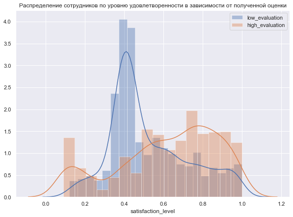


Распределение не похоже на нормальное, поэтому используем критерий Манна-Уитни.


```python
u, p_value = sts.mannwhitneyu(low_evaluation, high_evaluation)
print("two-sample wilcoxon-test", p_value)
```

    two-sample wilcoxon-test 1.0010804376936877e-48
    

p-value меньше 0,05, что позволяет нам говорить о том, что есть разница в уровне удовлетворенности у сотрудников получивших высокие и низкие оценки.

Узнаем, есть ли разница между уровнем удовлетворенности между сотрудниками отдела менеджмента и ИТ


```python
management= hr[hr['department']=='management']['satisfaction_level'].sample(n=630)
IT= hr[hr['department']=='IT']['satisfaction_level'].sample(n=630)
sns.distplot(management)
sns.distplot(IT)
plt.legend(['management', 'IT'])

```


    <matplotlib.legend.Legend at 0x174afc705f8>


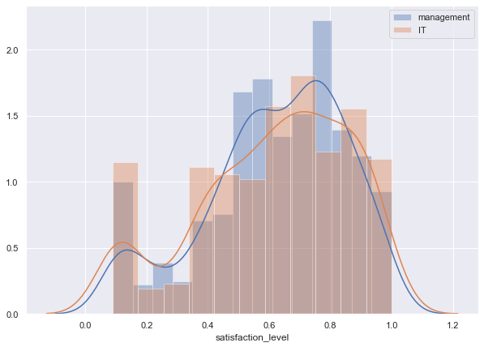


```python
u, p_value = sts.mannwhitneyu(management, IT)
print("two-sample wilcoxon-test", p_value)
```

    two-sample wilcoxon-test 0.4599094781208163
    

Тк распределение сотрудников отделов менеджмента и ИТ по уровню удовлетворенности тоже не похоже на нормальное, мы снова используем критерий Манна-Уитни.
В данном случае значение p-value больше 0,05, следовательно мы принимаем нулевую гипотезу о том, что выборки не отличаются между собой. То есть нет особой разницы между уровнем удовлетворенности сотрудников из разных отделов.


### Рассчитать сколько работников работает в каждом департаменте.


```python
hr_dep_stay=hr[hr['left']==0].groupby(['department']).count()['left'].reset_index()
hr_dep_stay.columns=['department','employees']
hr_dep_stay
```


<div>
<style scoped>
    .dataframe tbody tr th:only-of-type {
        vertical-align: middle;
    }

    .dataframe tbody tr th {
        vertical-align: top;
    }

    .dataframe thead th {
        text-align: right;
    }
</style>
<table border="1" class="dataframe">
  <thead>
    <tr style="text-align: right;">
      <th></th>
      <th>department</th>
      <th>employees</th>
    </tr>
  </thead>
  <tbody>
    <tr>
      <th>0</th>
      <td>IT</td>
      <td>954</td>
    </tr>
    <tr>
      <th>1</th>
      <td>RandD</td>
      <td>666</td>
    </tr>
    <tr>
      <th>2</th>
      <td>accounting</td>
      <td>563</td>
    </tr>
    <tr>
      <th>3</th>
      <td>hr</td>
      <td>524</td>
    </tr>
    <tr>
      <th>4</th>
      <td>management</td>
      <td>539</td>
    </tr>
    <tr>
      <th>5</th>
      <td>marketing</td>
      <td>655</td>
    </tr>
    <tr>
      <th>6</th>
      <td>product_mng</td>
      <td>704</td>
    </tr>
    <tr>
      <th>7</th>
      <td>sales</td>
      <td>3126</td>
    </tr>
    <tr>
      <th>8</th>
      <td>support</td>
      <td>1674</td>
    </tr>
    <tr>
      <th>9</th>
      <td>technical</td>
      <td>2023</td>
    </tr>
  </tbody>
</table>
</div>


### Показать распределение сотрудников по зарплатам.


Посмотрим распределение по нескольким группам сотрудников: всем, уволившихся и тех, кто продолжает работать в  организации.


```python
sns.set(style="darkgrid")
sns.countplot (x='salary', data=hr )
plt.title ('Распределение всех сотрудников по уровню зарплаты')
plt.ylabel('Количество сотрудников')
plt.xlabel('Уровень зарплаты')
```


    Text(0.5, 0, 'Уровень зарплаты')


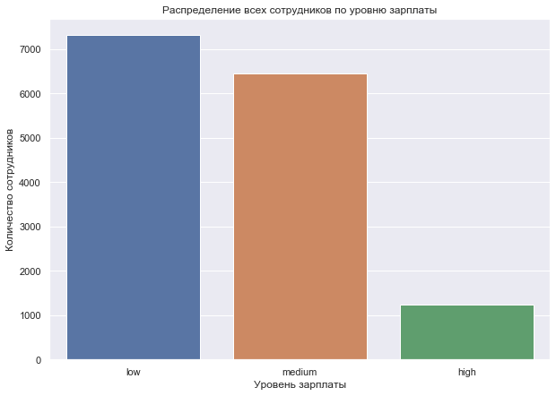


```python
left=hr[hr['left']==1]
sns.countplot (x='salary', data=left)
plt.title ('Распределение ушедших сотрудников по уровню зарплаты')
plt.ylabel('Количество сотрудников')
plt.xlabel('Уровень зарплаты')
```


    Text(0.5, 0, 'Уровень зарплаты')


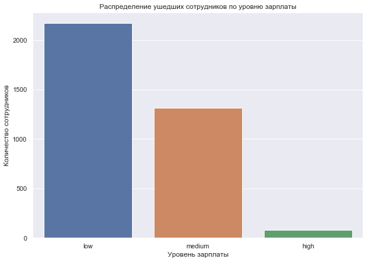


```python
stay=hr[hr['left']==0]
sns.countplot (x='salary', data=stay)
plt.title ('Распределение текущих сотрудников по уровню зарплаты')
plt.ylabel('Количество сотрудников')
plt.xlabel('Уровень зарплаты')
```


    Text(0.5, 0, 'Уровень зарплаты')


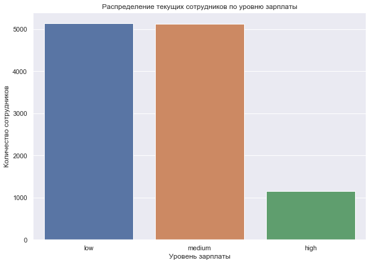


Из графиков видно, что среди тех, кто ушел превалируют сотрудники с низкой заработной платой. В то время как среди оставшихся доли сотрудников с низкой и средней зп приблизительно равны, а сотрудников с высокой зарплатой значительно больше.

### Показать распределение сотрудников по зарплатам совместно с департаментами

Аналогично предыдущему случаю, посмотрим распределение сотрудников различных департаментов по зп в зависимости от того, ушли ли они с работы или проолжают работать.


```python
salary_dep_stay=hr[hr['left']==0].groupby(['department','salary']).count()['left']
salary_dep_stay.columns=['department','salary','employees']
salary_dep_stay.unstack().plot(kind='bar', rot=60)
plt.title ('Распределение работающих сотрудников разных департаментов по уровню зарплаты')
plt.ylabel('Количество сотрудников')

```


    Text(0, 0.5, 'Количество сотрудников')


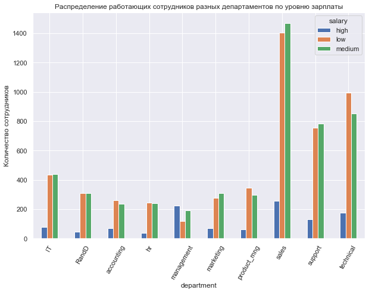


```python
salary_dep_left=hr[hr['left']==1].groupby(['department','salary']).count()['left']
salary_dep_left.columns=['department','salary','employees']
salary_dep_left.unstack().plot(kind='bar', rot=60)
plt.title ('Распределение уволившихся сотрудников разных департаментов по уровню зарплаты')
plt.ylabel('Количество сотрудников')
```


    Text(0, 0.5, 'Количество сотрудников')


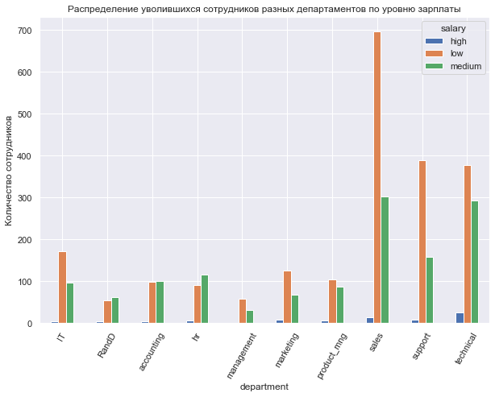


Из этих графиков мы видим, что практически во всех отделах большую долю из тех, кто уволился составляют сотрудники с низкой зп. Исключение составили отелы hr, randD, accounting, в них большую( или практически равную низкой зп) долю уволившихся составили люди со средней зп.
Еще интересной информацией для нас является то, что в отделе менеджмента среди работающих сотрудников доля тех, кто получает высокую зарплату больше тех, кто получает низкую и среднюю. 
Эти графики позволяют нам говорить о том, что между отделами идет неравномерное распределение заработных плат.

### Сколько сотрудников покинули компанию


```python
number_of_left=hr['left'][hr['left']==1].count()
number_of_left
```


    3571


### Проверить несколько гипотез для данных, чтобы понять почему сотрудники покидают компанию.

#### Проверим следующую гипотезу: Уровень удовлетворенности разный у уволившихся и оставшихся сотрудников.


```python
left_satlevel= hr[hr['left']==1]['satisfaction_level'].sample(n=3500)
stay_satlevel= hr[hr['left']==0]['satisfaction_level'].sample(n=3500)
sns.distplot(left_satlevel)
sns.distplot(stay_satlevel)
plt.legend(['Ушли', 'Остались'])
plt.title ('Распределение ушедших и работающих сотрудников по уровню удовлетворенности')

```


    Text(0.5, 1.0, 'Распределение ушедших и работающих сотрудников по уровню удовлетворенности')


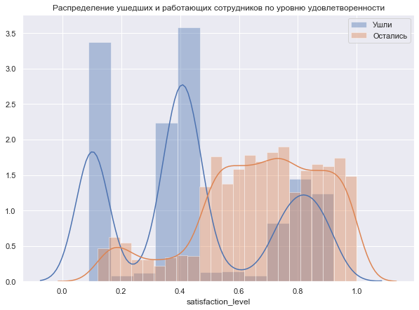


```python
u, p_value = sts.mannwhitneyu(left_satlevel, stay_satlevel)
print("two-sample wilcoxon-test", u, p_value)
```

    two-sample wilcoxon-test 3023715.5 4.702794939289679e-295
    

P-value стремится к 0, поэтому наша гипотеза о том, что уровень удовлетворенности у ушедших и оставшихся сотрудников различается, подтвердилась ( была опровергнута нулевая гипотеза, которая гласила, что выборки не отличаются мужду собой)

#### Проверим еще одну гипотзу: есть отличие в количестве проектов между теми кто ушел и остался.


```python
left_numprojects= hr[hr['left']==1]['number_projec'].sample(n=3500)
stay_numprojects= hr[hr['left']==0]['number_projec'].sample(n=3500)
sns.distplot(left_numprojects)
sns.distplot(stay_numprojects)
plt.legend(['Ушли', 'Остались'])
plt.title ('Распределение ушедших и работающих сотрудников по уровню удовлетворенности')
```


    Text(0.5, 1.0, 'Распределение ушедших и работающих сотрудников по уровню удовлетворенности')


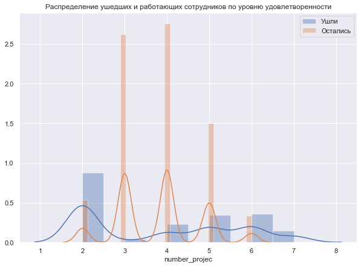


```python
u, p_value = sts.mannwhitneyu(left_numprojects, stay_numprojects)
print("two-sample wilcoxon-test",u, p_value)
```

    two-sample wilcoxon-test 5930651.5 0.009393828135295261
    

Наша гипотеза также подтвердилась, поскольку p=value меньше 0,05.

Чтобы более точно понимать влияние параметров на зависимую переменную 'left' построим модель методом решения деревьев. Данный метод нам хорошо подходит, поскольку позволяет работать с несбалансированными выборками, а также позволить увидеть наиболее важные атрибуты этой модели.

Перед тем как строить модель, присвоим каждому департаменту свой номер, чтобы мы могли учесть эту переменную в модели.


```python
def dep(a):
    if a=='sales':
        return 1
    if a=='accounting':
        return 2
    if a=='hr':
        return 3
    if a=='technical':
        return 4
    if a=='support':
        return 5
    if a=='management':
        return 6
    if a=='IT':
        return 7
    if a=='product_mng':
        return 8
    if a=='marketing':
        return 9
    if a=='RandD':
        return 10
hr['department_id'] = hr['department'].apply(dep)
```


```python
hr.head()
```


<div>
<style scoped>
    .dataframe tbody tr th:only-of-type {
        vertical-align: middle;
    }

    .dataframe tbody tr th {
        vertical-align: top;
    }

    .dataframe thead th {
        text-align: right;
    }
</style>
<table border="1" class="dataframe">
  <thead>
    <tr style="text-align: right;">
      <th></th>
      <th>satisfaction_level</th>
      <th>last_evaluation</th>
      <th>number_projec</th>
      <th>average_montly_hours</th>
      <th>time_spend_company</th>
      <th>Work_accident</th>
      <th>left</th>
      <th>promotion_last_5years</th>
      <th>department</th>
      <th>salary</th>
      <th>salary_level</th>
      <th>department_id</th>
    </tr>
  </thead>
  <tbody>
    <tr>
      <th>0</th>
      <td>0.38</td>
      <td>0.53</td>
      <td>2</td>
      <td>157</td>
      <td>3</td>
      <td>0</td>
      <td>1</td>
      <td>0</td>
      <td>sales</td>
      <td>low</td>
      <td>1</td>
      <td>1</td>
    </tr>
    <tr>
      <th>1</th>
      <td>0.80</td>
      <td>0.86</td>
      <td>5</td>
      <td>262</td>
      <td>6</td>
      <td>0</td>
      <td>1</td>
      <td>0</td>
      <td>sales</td>
      <td>medium</td>
      <td>2</td>
      <td>1</td>
    </tr>
    <tr>
      <th>2</th>
      <td>0.11</td>
      <td>0.88</td>
      <td>7</td>
      <td>272</td>
      <td>4</td>
      <td>0</td>
      <td>1</td>
      <td>0</td>
      <td>sales</td>
      <td>medium</td>
      <td>2</td>
      <td>1</td>
    </tr>
    <tr>
      <th>3</th>
      <td>0.72</td>
      <td>0.87</td>
      <td>5</td>
      <td>223</td>
      <td>5</td>
      <td>0</td>
      <td>1</td>
      <td>0</td>
      <td>sales</td>
      <td>low</td>
      <td>1</td>
      <td>1</td>
    </tr>
    <tr>
      <th>4</th>
      <td>0.37</td>
      <td>0.52</td>
      <td>2</td>
      <td>159</td>
      <td>3</td>
      <td>0</td>
      <td>1</td>
      <td>0</td>
      <td>sales</td>
      <td>low</td>
      <td>1</td>
      <td>1</td>
    </tr>
  </tbody>
</table>
</div>


Задаем зависимую переменную Y и независимые парметры X.


```python
Y = hr['left']
X = hr.iloc[:, [0,1,2,3,4,5,7,10,11]]
```

Для нашей модели разделяем данные на тренировочные и тестовые в пропорции 80% на 20 соответственно


```python
X_train, X_test, y_train, y_test = train_test_split(X, Y, test_size=0.2)
```

Создаем модель деревья решений и обучаем ее


```python
model=RandomForestClassifier(n_estimators=100)

model.fit(X_train, y_train)
```


    RandomForestClassifier(bootstrap=True, class_weight=None, criterion='gini',
                           max_depth=None, max_features='auto', max_leaf_nodes=None,
                           min_impurity_decrease=0.0, min_impurity_split=None,
                           min_samples_leaf=1, min_samples_split=2,
                           min_weight_fraction_leaf=0.0, n_estimators=100,
                           n_jobs=None, oob_score=False, random_state=None,
                           verbose=0, warm_start=False)


Смотрим, какие атрибуты согласно модели оказывают наиболее сильное влияние на факт увольнения


```python
headers = list(X_train.columns.values)

feature_imp = pd.Series(model.feature_importances_,index=headers).sort_values(ascending=False)

f, ax = plt.subplots(figsize=(10, 10))
sns.barplot(x=feature_imp, y=feature_imp.index)

plt.xlabel('Важность атрибутов')
plt.ylabel('Атрибуты')
plt.title("Наиболее важные атрибуты")
plt.show()
```


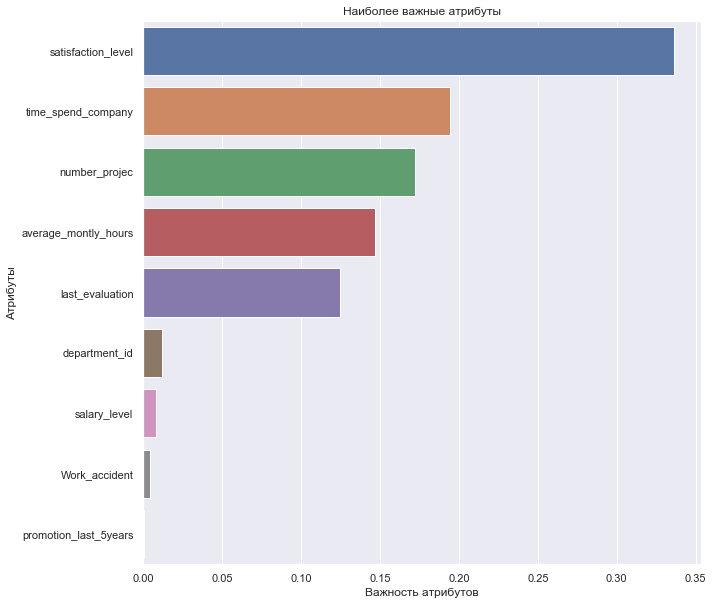


На графике видно, что наибольшее влияние на решение об уходе влияет уровень удовлетворенности. Также достаточно весомыми атрибутами являются:

время, проведенное в компании;

количество проектов, в которых участвует сотрудник;

среднее количество отработанных часов в месяц;

последняя оценка. 

Остальные переменные оказывают сравнительно небольшое влияние на зависимую переменную 'left'.

Теперь узнаем точность предсказания модели.


```python
model.score(X_test, y_test)
```


    0.9936666666666667


Модель предсказывает верный результат в 99% случаев, что является очень хорошим результатом, и говорит о высокой точности предсказания.
