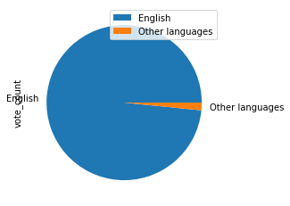
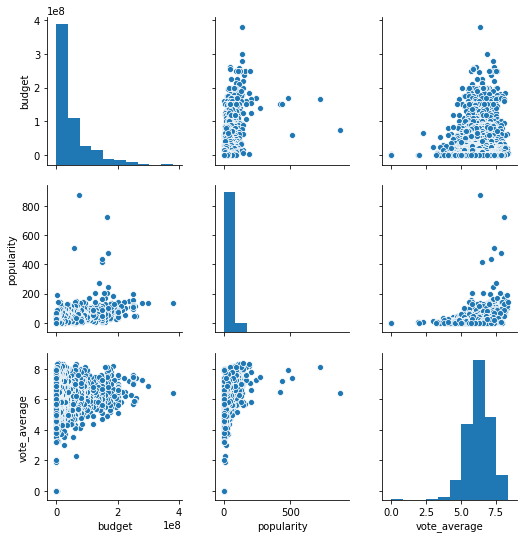
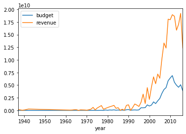
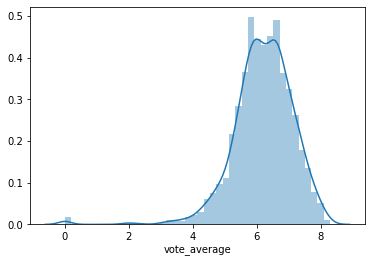
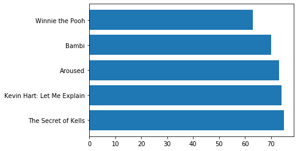

```python
from pylab import rcParams
rcParams['figure.figsize'] = 12,10


import pandas as pd
import matplotlib.pyplot as plt
import seaborn as sns
from datetime import datetime
```


```python
movies =pd.read_csv(
    'tmdb/tmdb_5000_movies.csv')
movies=movies.dropna()
```

### Задача: Узнать распределение людей, которые посмотрели  фильмы, снятые на английском языке и других языках
Для решения этой задачи мы разделили все фильмы на 2 группы: фильмы на английском и фильмы на остальных языках. 

Параметр vote_counts приравниваем к количеству людей, посмотревших фильм. Смотрим, сколько людей посмотрело англоязычное кино и кино, снятое на других языках.

Строим pie chart, тк данный график наглядно демонстрирует распределение долей: видно насколько больше доля людей, смотревших кино на английском, по сравнению с теми, кто смотрел на других языках.


```python
def group_language(a):
    if a == 'en':
        return 'English'
    return 'Other languages'
movies['language_group']=movies['original_language'].apply(group_language)


```


```python
movies_lang= (movies[['language_group','vote_count']].
              groupby('language_group').sum().sort_values('vote_count', ascending=False)
             )
movies_lang.plot(kind='pie', y = 'vote_count')
```


    <matplotlib.axes._subplots.AxesSubplot at 0x2a1deb57898>





### Задача: Посмотреть, существует ли взаимосвязь между бюджетом фильма, его популярностью и средней оценкой.
Используем pair plot (scatter plot matrix). В соответствии с задачей используем переменные 'budget','popularity', 'vote_average'.
Исходя из графика можно предположить, что чем выше бюджет фильма, тем выше средняя оценка. И чем выше средняя оценка, тем выше популярность( или чем выше популярность, тем выше оценка, здесь необходимо дополнительно изучать причинно-следственные связи). Между бюджетом и популярностью явной взаимосвязи на графике не видно.


```python
sns_plot = sns.pairplot(
    movies[['budget','popularity', 'vote_average']])
```





### Задача: Посмотреть, как менялись общий бюджет и выручка фильмов до 2016 года (включительно)
Из параметра 'release_date' вычленяем год выпуска. Фильтруем фильмы, выпущенные до 2016 года и строим график, отображающий все значения суммы бюджета и выручки всех фильмов.

На графике видно, что начиная с 90х годов траты на кинопроизводство начали расти, однако доходы от фильмов росли в значительно большей степени.


```python
list_=[]
for year in movies['release_date']:
    list_.append(year)
def year(a):
    if a in list_:
        return int(a[:4])
    else: 'No'
movies['year'] = movies['release_date'].apply(year)
```


```python
budget_by_years = movies[['year','budget','revenue']].groupby('year').sum()
budget_by_years
budget_by_years=budget_by_years[budget_by_years.index <= 2016]
budget_by_years.plot()
```


    <matplotlib.axes._subplots.AxesSubplot at 0x2a1de43f5f8>





### Задача: Посмотреть распределение оценок пользовтелей фильмов 21 века
Фильтруем данные по годам (начиная с 2000 года).
Строим распределение при помощи distplot по переменной vote_average . На графике видно, что распределение близко к нормальному и большая часть оценкок варьируется в пределах 6-7 баллов.


```python
movies_XXI=movies[(movies.year >= 2000)]

sns.distplot(movies_XXI.vote_average)
```


    <matplotlib.axes._subplots.AxesSubplot at 0x2a1de5e3908>





### Задача: Посмотреть топ 5 самых коротких фильмов
Используем переменные 'title', 'runtime', сортируем по показетелю длительности и берем 5 фильмов с наименьшим значением переменной. Строим bar chart, который наглядно продемонстрирует длительность фильмов и как они соотносятся между собой.

Мы видим, что разница длительсности между 1 и 5 фильмами не очень большая (порядка 10 минут).


```python
best_scores= movies[['title', 'runtime']].sort_values('runtime', ascending = False)
best_scores=best_scores[best_scores.runtime>0].tail()
plt.barh(best_scores['title'], best_scores['runtime'])
```


    <BarContainer object of 5 artists>




