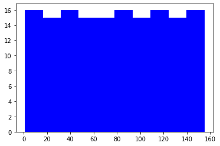
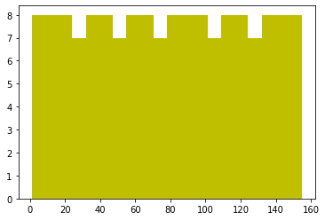
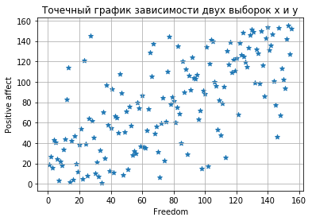
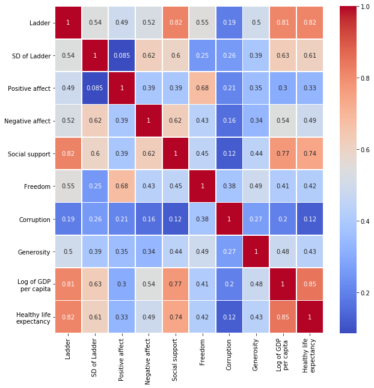
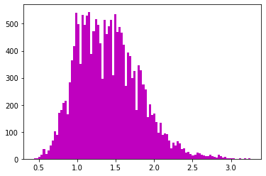
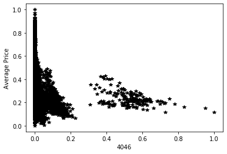

# Домашнее задание по статистическому анализу на python


```python
import pandas as pd
import numpy as np
import matplotlib.pyplot as plt
import scipy.stats as sts
%matplotlib inline
import statistics
```

Загрузить датасет по url:


```python
url="http://yustiks.ru/dataset/world-happiness-report-2019.csv"
df=pd.read_csv(url)
```

World happiness gauged by technologies, social norms, and government policies. Dataset created by PromptCloud's web crawling solution.


*  **Country (region)** Name of the country.
*  **Ladder** Cantril Ladder is a measure of life satisfaction.
*  **SD of Ladder** Standard deviation of the ladder.
*  **Positive affect** Measure of positive emotion.
*  **Negative affect** Measure of negative emotion.
*  **Social support** The extent to which Social support contributed to the calculation of the Happiness Score.
*  **Freedom** The extent to which Freedom contributed to the calculation of the Happiness Score.
*  **Corruption** The extent to which Perception of Corruption contributes to Happiness Score.
*  **Generosity** The extent to which Generosity contributed to the calculation of the Happiness Score.
*  **Log of GDP per capita** The extent to which GDP contributes to the calculation of the Happiness Score.
*  **Healthy life expectancy** The extent to which Life expectancy contributed to the calculation of the Happiness Score.

Посмотреть первые несколько рядов таблицы


```python
df.head()
```


<div>
<style scoped>
    .dataframe tbody tr th:only-of-type {
        vertical-align: middle;
    }

    .dataframe tbody tr th {
        vertical-align: top;
    }

    .dataframe thead th {
        text-align: right;
    }
</style>
<table border="1" class="dataframe">
  <thead>
    <tr style="text-align: right;">
      <th></th>
      <th>Country (region)</th>
      <th>Ladder</th>
      <th>SD of Ladder</th>
      <th>Positive affect</th>
      <th>Negative affect</th>
      <th>Social support</th>
      <th>Freedom</th>
      <th>Corruption</th>
      <th>Generosity</th>
      <th>Log of GDP
per capita</th>
      <th>Healthy life
expectancy</th>
    </tr>
  </thead>
  <tbody>
    <tr>
      <th>0</th>
      <td>Finland</td>
      <td>1</td>
      <td>4</td>
      <td>41.0</td>
      <td>10.0</td>
      <td>2.0</td>
      <td>5.0</td>
      <td>4.0</td>
      <td>47.0</td>
      <td>22.0</td>
      <td>27.0</td>
    </tr>
    <tr>
      <th>1</th>
      <td>Denmark</td>
      <td>2</td>
      <td>13</td>
      <td>24.0</td>
      <td>26.0</td>
      <td>4.0</td>
      <td>6.0</td>
      <td>3.0</td>
      <td>22.0</td>
      <td>14.0</td>
      <td>23.0</td>
    </tr>
    <tr>
      <th>2</th>
      <td>Norway</td>
      <td>3</td>
      <td>8</td>
      <td>16.0</td>
      <td>29.0</td>
      <td>3.0</td>
      <td>3.0</td>
      <td>8.0</td>
      <td>11.0</td>
      <td>7.0</td>
      <td>12.0</td>
    </tr>
    <tr>
      <th>3</th>
      <td>Iceland</td>
      <td>4</td>
      <td>9</td>
      <td>3.0</td>
      <td>3.0</td>
      <td>1.0</td>
      <td>7.0</td>
      <td>45.0</td>
      <td>3.0</td>
      <td>15.0</td>
      <td>13.0</td>
    </tr>
    <tr>
      <th>4</th>
      <td>Netherlands</td>
      <td>5</td>
      <td>1</td>
      <td>12.0</td>
      <td>25.0</td>
      <td>15.0</td>
      <td>19.0</td>
      <td>12.0</td>
      <td>7.0</td>
      <td>12.0</td>
      <td>18.0</td>
    </tr>
  </tbody>
</table>
</div>


Построить частотный график для двух параметров: Freedom и positive affect. Какое это распределение?


```python
hist_freedom = plt.hist(df['Freedom'], 10, facecolor='b')
```





```python
hist_PA= plt.hist(df['Positive affect'], 20, facecolor='y')
```





Распределение двух переменных Freedom  и Positive affect близко к равномерному

## Найти медиану, моду, математическое ожидание, стандартное отклонение,  дисперсию, минимум и максимум, найти выбросы (если есть), размах для колонки Freedom

### Выбросы


```python
df['Freedom'].isnull().sum()
```


    1


Удаляем выброс из рассмотрения


```python
freedom_clean= df['Freedom'].dropna()
```

### Медиана


```python
import statistics

print('Медиана: ', statistics.median(freedom_clean))

```

    Медиана:  78.0
    

### Среднее


```python
print ('Математическое ожидание: ', statistics.mean(freedom_clean))
```

    Математическое ожидание:  78.0
    

### Мода
В данном случае моды нет, тк каждое значение переменной встречается только 1 раз. Проверим это:


```python
freedom_count = len(freedom_clean) 
uniq_freedom_count = len(freedom_clean.unique())

if uniq_freedom_count == freedom_count:
    print ('Все значения моды встречаются 1 раз, моды нет')
else: print ('Мода есть')
```

    Все значения моды встречаются 1 раз, моды нет
    

### Стандартное отклонение


```python
statistics.pstdev(freedom_clean)
```


    44.74371464239419


### Дисперсия


```python
statistics.pvariance(freedom_clean)
```


    2002.0


### Минимум и максимум


```python
print(min(freedom_clean))
print(max(freedom_clean))
```

    1.0
    155.0
    

### Размах


```python
max(freedom_clean) -min(freedom_clean) 
```


    154.0


## Посмотреть корреляцию между Freedom и positive affect (графически и математически). Графически - plt.scatter, математически - посчитать коэффициент Пирсона. О чем говорит знак коэффициента?

Проверим есть ли выбросы в 'Positive affect', если да, то узнаем находится ли выброс по этой переменной в том же наблюдении, что и выброс по переменной 'Freedom'.

Если выбросы находятся в одном набюдении, его можно исключить из корреляционного анализа.


```python
if df.index[df['Positive affect'].isnull()] == df.index[df['Positive affect'].isnull()]:
    print (True)
    pa_clean= df['Positive affect'].dropna()
```

    True
    


```python
plt.xlabel('Freedom')
plt.ylabel('Positive affect')
plt.title('Точечный график зависимости двух выборок x и y')
plt.grid(True)
plt.scatter(freedom_clean, pa_clean, marker='*')
```


    <matplotlib.collections.PathCollection at 0x1a979c3a0f0>





На графике видно, что существует тенденция к прямой линейной зависимости. Однако разброс значений достоточно велик, чтобы судить по графику о наличии зависимости. Поэтому необходимо произвести расчет коэффициента корреляции Пирсона.


```python
from scipy.stats import pearsonr
corr_P, p_value= pearsonr(freedom_clean, pa_clean)
print('Коэффициент корреляции Пирсона:', corr_P)
```

    Коэффициент корреляции Пирсона: 0.6817698430601656
    

Коэффициент показал наличие связи, однако теснота этой связи невысокая, что может говорить о том, что на эти показатели влияют и другие факоры.

### Нормализовать данные колонки Freedom (централизация + масштабирование)


```python
freedom_av = freedom_clean - statistics.mean(freedom_clean)
print(statistics.mean(freedom_av))

from sklearn import preprocessing
min_max_scaler = preprocessing.MinMaxScaler(feature_range=(-1,1))

freedom_norm = min_max_scaler.fit_transform(np.array(freedom_av).reshape(-1, 1))
print(min(freedom_norm))
print(max(freedom_norm))
```

    0.0
    [-1.]
    [1.]
    

### Построить матрицу корреляций для всех колонок таблицы


```python
import seaborn as sns
sns.heatmap(df.corr(),annot=True,cmap='coolwarm',linewidths=0.8) 
fig=plt.gcf()
fig.set_size_inches(10,10)
plt.show()
```





### Загрузить следующую таблицу: 


```python
import io
import requests
url="http://yustiks.ru/avocado.csv"
df=pd.read_csv(url)
df[:3]
```


<div>
<style scoped>
    .dataframe tbody tr th:only-of-type {
        vertical-align: middle;
    }

    .dataframe tbody tr th {
        vertical-align: top;
    }

    .dataframe thead th {
        text-align: right;
    }
</style>
<table border="1" class="dataframe">
  <thead>
    <tr style="text-align: right;">
      <th></th>
      <th>Unnamed: 0</th>
      <th>Date</th>
      <th>AveragePrice</th>
      <th>Total Volume</th>
      <th>4046</th>
      <th>4225</th>
      <th>4770</th>
      <th>Total Bags</th>
      <th>Small Bags</th>
      <th>Large Bags</th>
      <th>XLarge Bags</th>
      <th>type</th>
      <th>year</th>
      <th>region</th>
    </tr>
  </thead>
  <tbody>
    <tr>
      <th>0</th>
      <td>0</td>
      <td>2015-12-27</td>
      <td>1.33</td>
      <td>64236.62</td>
      <td>1036.74</td>
      <td>54454.85</td>
      <td>48.16</td>
      <td>8696.87</td>
      <td>8603.62</td>
      <td>93.25</td>
      <td>0.0</td>
      <td>conventional</td>
      <td>2015</td>
      <td>Albany</td>
    </tr>
    <tr>
      <th>1</th>
      <td>1</td>
      <td>2015-12-20</td>
      <td>1.35</td>
      <td>54876.98</td>
      <td>674.28</td>
      <td>44638.81</td>
      <td>58.33</td>
      <td>9505.56</td>
      <td>9408.07</td>
      <td>97.49</td>
      <td>0.0</td>
      <td>conventional</td>
      <td>2015</td>
      <td>Albany</td>
    </tr>
    <tr>
      <th>2</th>
      <td>2</td>
      <td>2015-12-13</td>
      <td>0.93</td>
      <td>118220.22</td>
      <td>794.70</td>
      <td>109149.67</td>
      <td>130.50</td>
      <td>8145.35</td>
      <td>8042.21</td>
      <td>103.14</td>
      <td>0.0</td>
      <td>conventional</td>
      <td>2015</td>
      <td>Albany</td>
    </tr>
  </tbody>
</table>
</div>


### Сделать частотный график колонки AveragePrice. Какое это распределение?


```python
hist_avprice= plt.hist(df['AveragePrice'], 100, facecolor='m')
```





```python
print (statistics.mean(df['AveragePrice']))
print (statistics.mode(df['AveragePrice']))
```

    1.405978409775878
    1.15
    

Распределение стремится к нормальному. Поскольку значение моды располагается левее (меньше) математического ожидания, то мы имеем дело с положительной ассиметрией относительно идеального нормального распределения. 

### Найти корреляцию в следующих колонках:

Корелляция между: 4046 - Total number of avocados with PLU 4046 sold  и например Average Price. Если корелляция есть, то скорее всего, данный вид авокадо дорогой по цене и он влияет на среднюю стоимость.


```python
from sklearn import preprocessing
min_max_scaler = preprocessing.MinMaxScaler(feature_range=(0,1))

np_scaled = min_max_scaler.fit_transform(df[['4046', 'AveragePrice']])
df_norm = pd.DataFrame(np_scaled)
print(df_norm[:5])
```

              0         1
    0  0.000046  0.316726
    1  0.000030  0.323843
    2  0.000035  0.174377
    3  0.000050  0.227758
    4  0.000041  0.298932
    


```python
type_4046=df_norm[0]
AveragePrice=df_norm[1]

plt.xlabel('4046')
plt.ylabel('Average Price')

plt.plot(type_4046, AveragePrice, 'k*')
plt.show()

corr, p_value = pearsonr(type_4046, AveragePrice)
print ('Коэффициент корреляции Пирсона - ', corr)
```





    Коэффициент корреляции Пирсона -  -0.2083170484878848
    

Отрицательный знак перед коэффициентом Пирсона говорит о том, что существует отрицательная зависимость между переменными. Однако сила этой зависимости очень маленькая, что не позволяет говорить нам о том, что изменение одной из переменной в значительной степени влияет на изменение другой.
Эти выводы также подтверждает и график: при более низкой средней цене объемы продаж манго типа 4046 начали расти, однако также видим что при одинаковых значениях средней цены значения объемов продаж очень сильно разнятся. И тоже самое с объемами продаж: в большинстве случаев одинаковый объем продаж был произведен при разных показателях средней цены.
