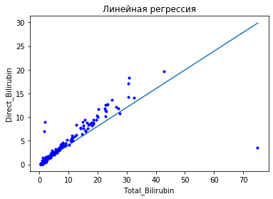
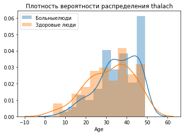
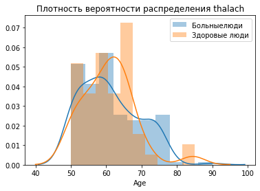

# Домашнее задание №3


```python
import numpy as np
from scipy.stats import t
from scipy.stats import norm
import matplotlib.pyplot as plt
from scipy import stats
import pandas as pd
import io
import requests
import seaborn as sns

%matplotlib inline
```

Таблица Indian liver pations records.


```python
url="http://yustiks.ru/dataset/indian_liver_patient.csv"
data=pd.read_csv(url)
data.tail()
```


<div>
<style scoped>
    .dataframe tbody tr th:only-of-type {
        vertical-align: middle;
    }

    .dataframe tbody tr th {
        vertical-align: top;
    }

    .dataframe thead th {
        text-align: right;
    }
</style>
<table border="1" class="dataframe">
  <thead>
    <tr style="text-align: right;">
      <th></th>
      <th>Age</th>
      <th>Gender</th>
      <th>Total_Bilirubin</th>
      <th>Direct_Bilirubin</th>
      <th>Alkaline_Phosphotase</th>
      <th>Alamine_Aminotransferase</th>
      <th>Aspartate_Aminotransferase</th>
      <th>Total_Protiens</th>
      <th>Albumin</th>
      <th>Albumin_and_Globulin_Ratio</th>
      <th>Dataset</th>
    </tr>
  </thead>
  <tbody>
    <tr>
      <th>578</th>
      <td>60</td>
      <td>Male</td>
      <td>0.5</td>
      <td>0.1</td>
      <td>500</td>
      <td>20</td>
      <td>34</td>
      <td>5.9</td>
      <td>1.6</td>
      <td>0.37</td>
      <td>2</td>
    </tr>
    <tr>
      <th>579</th>
      <td>40</td>
      <td>Male</td>
      <td>0.6</td>
      <td>0.1</td>
      <td>98</td>
      <td>35</td>
      <td>31</td>
      <td>6.0</td>
      <td>3.2</td>
      <td>1.10</td>
      <td>1</td>
    </tr>
    <tr>
      <th>580</th>
      <td>52</td>
      <td>Male</td>
      <td>0.8</td>
      <td>0.2</td>
      <td>245</td>
      <td>48</td>
      <td>49</td>
      <td>6.4</td>
      <td>3.2</td>
      <td>1.00</td>
      <td>1</td>
    </tr>
    <tr>
      <th>581</th>
      <td>31</td>
      <td>Male</td>
      <td>1.3</td>
      <td>0.5</td>
      <td>184</td>
      <td>29</td>
      <td>32</td>
      <td>6.8</td>
      <td>3.4</td>
      <td>1.00</td>
      <td>1</td>
    </tr>
    <tr>
      <th>582</th>
      <td>38</td>
      <td>Male</td>
      <td>1.0</td>
      <td>0.3</td>
      <td>216</td>
      <td>21</td>
      <td>24</td>
      <td>7.3</td>
      <td>4.4</td>
      <td>1.50</td>
      <td>2</td>
    </tr>
  </tbody>
</table>
</div>


Columns:

*  Age of the patient
*  Gender of the patient
*  Total Bilirubin
*  Direct Bilirubin
*  Alkaline Phosphotase
*  Alamine Aminotransferase
*  Aspartate Aminotransferase
*  Total Protiens
*  Albumin
*  Albumin and Globulin Ratio
*  Dataset: field used to split the data into two sets (patient with liver disease, or no disease)


#### Построить одномерную линейную регрессию Direct_Bilirubin и Total_Bilirubin. Построить график. Строим прямую с помощью уравнения которое мы посчитали. Предсказать несколько элементов из таблицы с помощью метода predict() и сравнить с результатом табличным.


```python
from sklearn.linear_model import LinearRegression
Direct_Bilirubin= data['Direct_Bilirubin']
Total_Bilirubin = data['Total_Bilirubin']
reg = LinearRegression()
result = reg.fit(np.array(Total_Bilirubin).reshape(-1,1), Direct_Bilirubin)

print('intercept:', reg.intercept_)

print('slope:', reg.coef_)
```

    intercept: 0.18116743679724845
    slope: [0.39557996]
    


```python
plt.xlabel('Total_Bilirubin')
plt.ylabel('Direct_Bilirubin')
plt.title('Линейная регрессия')
x = np.linspace(min(Total_Bilirubin), max(Total_Bilirubin), 100)
y = reg.coef_*x + reg.intercept_
plt.plot(x,y)
plt.plot(Total_Bilirubin, Direct_Bilirubin, 'b.')
plt.show()
```





На  графике отчетливо видно, что с увеличением значений обоих видов билирубина идет большее отклонение от нашей регрессионной модели. Соответственно, наша модель может хорошо предсказать значения прямого билирубина, когда мы задаем не слишком высокий показатель общего билирубина. Чем меньше показатель общего, тем точнее будет предсказан показатель прямого билирубина.
Этот вывод подтверждают цифры, приведенные ниже.


```python
print(reg.predict(np.array([25]).reshape(-1, 1)))
print(reg.predict(np.array([7.7]).reshape(-1, 1)))
print(reg.predict(np.array([3]).reshape(-1, 1)))
```

    [10.07066651]
    [3.22713315]
    [1.36790733]
    


```python
print(data['Direct_Bilirubin'][data['Total_Bilirubin'] == 25])
print(data['Direct_Bilirubin'][data['Total_Bilirubin'] == 7.7])
print (data['Direct_Bilirubin'][data['Total_Bilirubin'] == 3])

```

    575    13.7
    Name: Direct_Bilirubin, dtype: float64
    569    4.1
    Name: Direct_Bilirubin, dtype: float64
    127    1.4
    167    1.5
    Name: Direct_Bilirubin, dtype: float64
    

#### Построить многомерную линейную регрессию для предсказания болезни (Dataset) от двух параметров. Параметры подобрать с помощью матрицы корреляций. Предсказать несколько значений из таблицы и сравнить результат модели от табличного значения.


```python
data.corr()
```


<div>
<style scoped>
    .dataframe tbody tr th:only-of-type {
        vertical-align: middle;
    }

    .dataframe tbody tr th {
        vertical-align: top;
    }

    .dataframe thead th {
        text-align: right;
    }
</style>
<table border="1" class="dataframe">
  <thead>
    <tr style="text-align: right;">
      <th></th>
      <th>Age</th>
      <th>Total_Bilirubin</th>
      <th>Direct_Bilirubin</th>
      <th>Alkaline_Phosphotase</th>
      <th>Alamine_Aminotransferase</th>
      <th>Aspartate_Aminotransferase</th>
      <th>Total_Protiens</th>
      <th>Albumin</th>
      <th>Albumin_and_Globulin_Ratio</th>
      <th>Dataset</th>
    </tr>
  </thead>
  <tbody>
    <tr>
      <th>Age</th>
      <td>1.000000</td>
      <td>0.011763</td>
      <td>0.007529</td>
      <td>0.080425</td>
      <td>-0.086883</td>
      <td>-0.019910</td>
      <td>-0.187461</td>
      <td>-0.265924</td>
      <td>-0.216408</td>
      <td>-0.137351</td>
    </tr>
    <tr>
      <th>Total_Bilirubin</th>
      <td>0.011763</td>
      <td>1.000000</td>
      <td>0.874618</td>
      <td>0.206669</td>
      <td>0.214065</td>
      <td>0.237831</td>
      <td>-0.008099</td>
      <td>-0.222250</td>
      <td>-0.206267</td>
      <td>-0.220208</td>
    </tr>
    <tr>
      <th>Direct_Bilirubin</th>
      <td>0.007529</td>
      <td>0.874618</td>
      <td>1.000000</td>
      <td>0.234939</td>
      <td>0.233894</td>
      <td>0.257544</td>
      <td>-0.000139</td>
      <td>-0.228531</td>
      <td>-0.200125</td>
      <td>-0.246046</td>
    </tr>
    <tr>
      <th>Alkaline_Phosphotase</th>
      <td>0.080425</td>
      <td>0.206669</td>
      <td>0.234939</td>
      <td>1.000000</td>
      <td>0.125680</td>
      <td>0.167196</td>
      <td>-0.028514</td>
      <td>-0.165453</td>
      <td>-0.234166</td>
      <td>-0.184866</td>
    </tr>
    <tr>
      <th>Alamine_Aminotransferase</th>
      <td>-0.086883</td>
      <td>0.214065</td>
      <td>0.233894</td>
      <td>0.125680</td>
      <td>1.000000</td>
      <td>0.791966</td>
      <td>-0.042518</td>
      <td>-0.029742</td>
      <td>-0.002375</td>
      <td>-0.163416</td>
    </tr>
    <tr>
      <th>Aspartate_Aminotransferase</th>
      <td>-0.019910</td>
      <td>0.237831</td>
      <td>0.257544</td>
      <td>0.167196</td>
      <td>0.791966</td>
      <td>1.000000</td>
      <td>-0.025645</td>
      <td>-0.085290</td>
      <td>-0.070040</td>
      <td>-0.151934</td>
    </tr>
    <tr>
      <th>Total_Protiens</th>
      <td>-0.187461</td>
      <td>-0.008099</td>
      <td>-0.000139</td>
      <td>-0.028514</td>
      <td>-0.042518</td>
      <td>-0.025645</td>
      <td>1.000000</td>
      <td>0.784053</td>
      <td>0.234887</td>
      <td>0.035008</td>
    </tr>
    <tr>
      <th>Albumin</th>
      <td>-0.265924</td>
      <td>-0.222250</td>
      <td>-0.228531</td>
      <td>-0.165453</td>
      <td>-0.029742</td>
      <td>-0.085290</td>
      <td>0.784053</td>
      <td>1.000000</td>
      <td>0.689632</td>
      <td>0.161388</td>
    </tr>
    <tr>
      <th>Albumin_and_Globulin_Ratio</th>
      <td>-0.216408</td>
      <td>-0.206267</td>
      <td>-0.200125</td>
      <td>-0.234166</td>
      <td>-0.002375</td>
      <td>-0.070040</td>
      <td>0.234887</td>
      <td>0.689632</td>
      <td>1.000000</td>
      <td>0.163131</td>
    </tr>
    <tr>
      <th>Dataset</th>
      <td>-0.137351</td>
      <td>-0.220208</td>
      <td>-0.246046</td>
      <td>-0.184866</td>
      <td>-0.163416</td>
      <td>-0.151934</td>
      <td>0.035008</td>
      <td>0.161388</td>
      <td>0.163131</td>
      <td>1.000000</td>
    </tr>
  </tbody>
</table>
</div>


```python

Total_Protiens= data['Total_Protiens']
Direct_Bilirubin = data['Direct_Bilirubin']
Dataset = data['Dataset']
x = np.vstack([np.array(Total_Protiens), np.array(Direct_Bilirubin)]).T
y = np.array(Dataset)
model = LinearRegression().fit(x, y)

print('intercept:', model.intercept_)

print('slope:', model.coef_)

```

    intercept: 1.250837734631008
    slope: [ 0.01457959 -0.03964089]
    

Были выбраны показатели Direct_Bilirubin	и Total_Protiens, тк они, можно сказать, не  вообще коррелируют между собой. При этом прямой билирубин больше остальных показателей влияет на показатель dataset. Однако стоит отметить, что ни один параметр не имеет значимой линейной связи с параметром Dataset.
Построив регрессионную модель, мы видим, что билирубин в большей степени влияет на статус пациента (болен/здоров), чем показетель общего протеина. Однако сами коэффициенты очень маленькие, поэтому на их основе нежелательно строить предсказание статуса больного.

Это подтверждается цифрами. Ниже мы попробовали предсказать статус 2 пациентов, один из которых был признан здоровым, а другой - больным. При этом и одному, и другому пациенту модель предсказывает практически одинаковую вероятность болезни (33 и 34 % соответственно), что не соответствует истине.


```python
print('Предсказание модели: ', model.predict(x[-2:]))
```

    Предсказание модели:  [1.33015849 1.34537646]
    

#### Посчитать квартили для всех колонок. 


```python
data.describe()[4:7]
```


<div>
<style scoped>
    .dataframe tbody tr th:only-of-type {
        vertical-align: middle;
    }

    .dataframe tbody tr th {
        vertical-align: top;
    }

    .dataframe thead th {
        text-align: right;
    }
</style>
<table border="1" class="dataframe">
  <thead>
    <tr style="text-align: right;">
      <th></th>
      <th>Age</th>
      <th>Total_Bilirubin</th>
      <th>Direct_Bilirubin</th>
      <th>Alkaline_Phosphotase</th>
      <th>Alamine_Aminotransferase</th>
      <th>Aspartate_Aminotransferase</th>
      <th>Total_Protiens</th>
      <th>Albumin</th>
      <th>Albumin_and_Globulin_Ratio</th>
      <th>Dataset</th>
    </tr>
  </thead>
  <tbody>
    <tr>
      <th>25%</th>
      <td>33.0</td>
      <td>0.8</td>
      <td>0.2</td>
      <td>175.5</td>
      <td>23.0</td>
      <td>25.0</td>
      <td>5.8</td>
      <td>2.6</td>
      <td>0.70</td>
      <td>1.0</td>
    </tr>
    <tr>
      <th>50%</th>
      <td>45.0</td>
      <td>1.0</td>
      <td>0.3</td>
      <td>208.0</td>
      <td>35.0</td>
      <td>42.0</td>
      <td>6.6</td>
      <td>3.1</td>
      <td>0.93</td>
      <td>1.0</td>
    </tr>
    <tr>
      <th>75%</th>
      <td>58.0</td>
      <td>2.6</td>
      <td>1.3</td>
      <td>298.0</td>
      <td>60.5</td>
      <td>87.0</td>
      <td>7.2</td>
      <td>3.8</td>
      <td>1.10</td>
      <td>2.0</td>
    </tr>
  </tbody>
</table>
</div>


#### Построить график histogram двух выборок по наличию или отсутствию болезни: люди, возрастом до 50 лет, и люди после 50 лет. Посчитать среднее значение и квартиль 0.5 в данных выборках. Чем они отличаются?


```python
young_data= data[data['Age']<50]
ill_and_young = young_data[young_data['Dataset']==1]['Age']
healthy_and_young = young_data[young_data['Dataset']==2]['Age']
sns.distplot(ill_and_young,10)
sns.distplot(healthy_and_young,10)
plt.title('Плотность вероятности распределения thalach')
plt.legend(['Больныелюди', 'Здоровые люди'])
plt.show()
print('Средний возраст больных пациентов: ', round(ill_and_young.mean(),))
print('Средний возраст здоровых пациентов: ', round(healthy_and_young.mean(),))
print(ill_and_young.quantile([.50]))
print(healthy_and_young.quantile([.50]))
```





    Средний возраст больных пациентов:  35
    Средний возраст здоровых пациентов:  32
    0.5    37.0
    Name: Age, dtype: float64
    0.5    34.0
    Name: Age, dtype: float64
    


    34.18130311614731


График и рассчитанные показатели говорят нам о том, что в группе людей, моложе 50 лет, распределение больных и здоровых пациентов немного отличаются. Средний возраст больных пациентов выше, чем у молодых. То же самое и с показателями квартилей: 50% больных моложе 37 лет, а здоровых -34. Отличие значений квартилей в большую сторону от среднего значения говорит, что в данных есть "выбросы" в виде малолетних пациентов.


```python

old_data= data[data['Age']>=50]
ill_and_old = old_data[old_data['Dataset']==1]['Age']
healthy_and_old = old_data[old_data['Dataset']==2]['Age']
sns.distplot(ill_and_old,10)
sns.distplot(healthy_and_old,10)
plt.title('Плотность вероятности распределения thalach')
plt.legend(['Больныелюди', 'Здоровые люди'])
plt.show()
print('Средний возраст больных пациентов: ', round(ill_and_old.mean(),2))
print('Средний возраст здоровых пациентов: ', round(healthy_and_old.mean(),2))
print(ill_and_old.quantile([.50]))
print(healthy_and_old.quantile([.50]))
```





    Средний возраст больных пациентов:  61.02
    Средний возраст здоровых пациентов:  60.76
    0.5    60.0
    Name: Age, dtype: float64
    0.5    60.0
    Name: Age, dtype: float64
    

В группе людей, старше 50 лет, распределение больных и здоровых пациентов практически одинаково. Это может свидетельствовать о том, что после 50 лет болезни печени редко появляются впервые (в этой возрастной категории уже возраст не так сильно влияет на вероятность болезни). 


#### Посчитать критерий одновыборочный t-критерий для выборки по критерию Total_Bilirubin у больных людей. Как показатель помогает понять, что выборки не похожа на генеральную совокупность?


```python
sick_blrb = data[data['Dataset']==2]['Total_Bilirubin']
stats.ttest_1samp(sick_blrb, data['Total_Bilirubin'].mean())
```


    Ttest_1sampResult(statistic=-27.741265868012505, pvalue=3.180002804533163e-64)


Сначала мы смотрим на показетль p-value, он меньше 0,05. А значение t-value = -27.7, что является всоким показателем. Это говорит нам о том, что выборки отличаются друг от друга. То есть статистически значимая разница между показателями билирубина у больных людей и у людей в целом.

#### Посчитать критерий t для двух выборок: больные и здоровые (по критерию Total_Bilirubin). Имеют ли данные группы схожесть?


```python
sick_blrb = data[data['Dataset']==2]['Total_Bilirubin']
healthy_blrb = data[data['Dataset']==1]['Total_Bilirubin']
stats.ttest_ind(sick_blrb, healthy_blrb)
```


    Ttest_indResult(statistic=-5.441441126834863, pvalue=7.801430929364345e-08)


Аналогичная ситуация как в случае с предыдущей выборкой. Эти 2 выборки отличны друг от друга. То есть показатели билирубина у больных и здоровых людей отличаются

#### Посчитать статистическую значимость для трех выборок (по возрасту) - 1ая группа от 1 до 30 лет, 2ая группа от 30 лет до 55, 3я группа более 55 по выборке Dataset. Сравнить с реальностью (они логично что будут отличаться).


```python
age_0 = data[data['Age']<30]['Dataset']

age_1 = data[(data['Age']>=30)&(data['Age']<55)]['Dataset']

age_2 = data[(data['Age']>=55)]['Dataset']

stats.f_oneway(age_0, age_1, age_2)
```


    F_onewayResult(statistic=9.375048806025259, pvalue=9.837730889092287e-05)


Показатели p-value и t-value говорят нам о том, что действительно выборки отличаются. Это очень логично, потому что с возрастом количество соотношение больных и здоровых людей изменяется.

Вопросы задавать на почту yustiks@gmail.com
